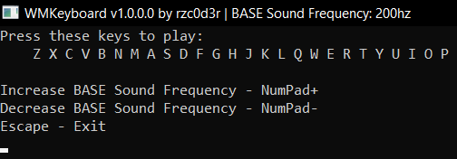

# WMKeyboard
WMKeyboard - Turn your keyboard into a sound synthesizer



---

# How to use
---
## From releases
1. Run the **.exe** and use the keyboard keys specified in the console to generate the sound (the sound frequency increases from Z -> P)
2. **That's all!**

--- 
## From sources
1. Download the source code of the project
2. Open the **WMKeyboard.sln** solution file using **Visual Studio**
3. All dependencies must be specified to successfully build the project (**for each configuration**):
   ### Properties -> C/C++ -> General -> Additional Include Directories
   Just type in ```include```
   
   ---
   
   ### Properties -> Linker -> General -> Additional Library Directories
   Type in ```lib/x32``` - for **Win32 Configuration**
   
   Type in ```lib/x64``` - for **Win64 Configuration**

   ---
   
   ### Properties -> Linker -> Input -> Additional Dependencies
   Type in ```bass.lib```

4. Compile the project and you will get an **.exe** file
   > To successfully run **.exe** you need the library **bass.dll** copy it to the location of the **.exe** file!!!
   >
   > Win32 build: dll/x32/bass.dll
   >
   > Win64 build: dll/x64/bass.dll
5. Run the **.exe** and use the keyboard keys specified in the console to generate the sound (the sound frequency increases from Z -> P)
6. **That's all!**

---

# Useful information
1. To avoid constantly copying **bass.dll** to **.exe**, you can automate this process by using the settings in the properties:
   ### Properties -> Build Events -> Post-Build Event -> Command Line
   Type in ```xcopy /Y /I "$(SolutionDir)dll\x32\bass.dll" "$(TargetDir)"``` - for **Win32 Configuration**
   
   Type in ```xcopy /Y /I "$(SolutionDir)dll\x64\bass.dll" "$(TargetDir)"``` - for **Win64 Configuration**
